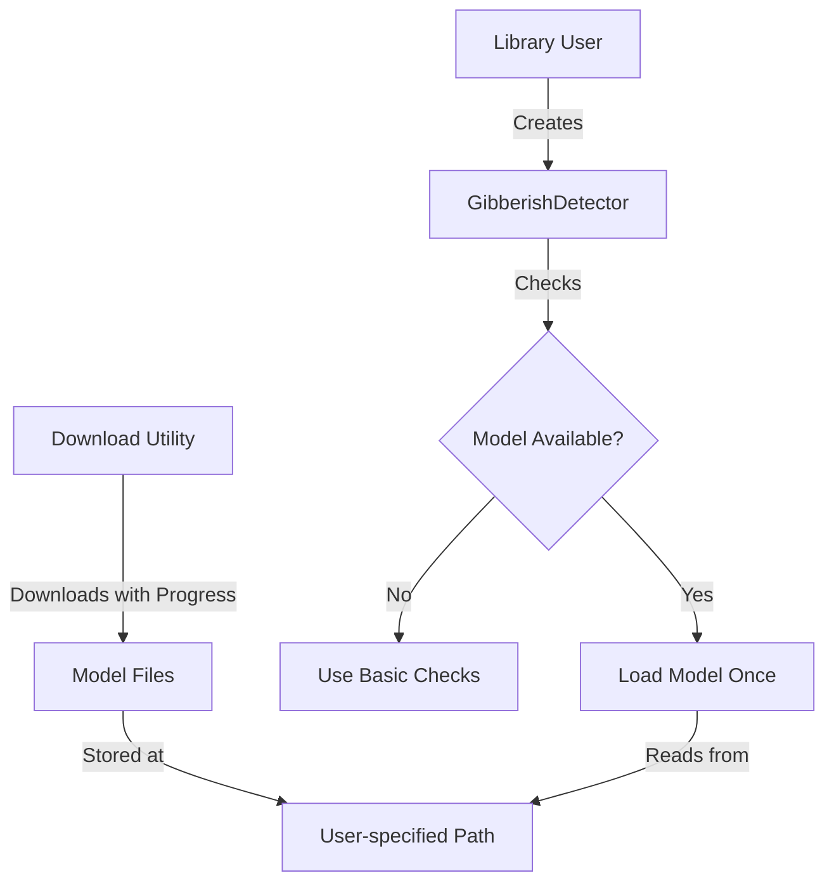

# HuggingFace Model Integration Plan

## Overview

This document outlines the plan to integrate HuggingFace's AutoNLP gibberish detection model as an optional enhancement to the existing gibberish detection system. The model will be:
- Optional to use
- Configurable model path
- Loaded only once when needed
- Fully synchronous

## Architecture



## Implementation Details

### 1. Model Management (src/model.rs)

```rust
use std::path::PathBuf;
use std::sync::OnceLock;

pub struct Model {
    inner: tch::CModule,
}

/// Static storage for loaded model
static MODEL: OnceLock<Option<Model>> = OnceLock::new();

impl Model {
    /// Check if model exists at given path
    pub fn exists(path: &Path) -> bool {
        path.exists() && path.join("model.bin").exists()
    }

    /// Get or load model singleton
    pub fn get_or_load(path: &Path) -> Option<&'static Model> {
        MODEL.get_or_init(|| {
            if !Self::exists(path) {
                return None;
            }
            
            // Load model only when first needed
            match Self::load(path) {
                Ok(model) => Some(model),
                Err(_) => None,
            }
        }).as_ref()
    }

    /// Load model from disk
    fn load(path: &Path) -> Result<Self, Box<dyn std::error::Error>> {
        let model = tch::CModule::load(path.join("model.bin"))?;
        Ok(Self { inner: model })
    }

    /// Run inference
    fn predict(&self, text: &str) -> bool {
        // Run model inference
        // Return true if gibberish, false if valid text
    }
}
```

### 2. Library Interface (src/lib.rs)

```rust
use std::path::PathBuf;
use crate::model::Model;

pub struct GibberishDetector {
    model_path: Option<PathBuf>,
}

impl GibberishDetector {
    /// Create new detector with no model
    pub fn new() -> Self {
        Self { model_path: None }
    }

    /// Create new detector with model path
    pub fn with_model<P: Into<PathBuf>>(path: P) -> Self {
        Self {
            model_path: Some(path.into()),
        }
    }

    /// Check if model is available
    pub fn has_enhanced_detection(&self) -> bool {
        self.model_path
            .as_ref()
            .map(|p| Model::exists(p))
            .unwrap_or(false)
    }

    /// Main detection function
    pub fn is_gibberish(&self, text: &str, sensitivity: Sensitivity) -> bool {
        // Run basic checks first
        let basic_result = self.run_basic_checks(text, sensitivity);
        
        // If basic checks say it's gibberish, no need for model
        if basic_result {
            return true;
        }
        
        // Try enhanced detection if available
        if let Some(path) = &self.model_path {
            if let Some(model) = Model::get_or_load(path) {
                return model.predict(text);
            }
        }
        
        // Fall back to basic result
        basic_result
    }

    // Keep the existing implementation
    fn run_basic_checks(&self, text: &str, sensitivity: Sensitivity) -> bool {
        // Existing implementation...
    }
}

/// Download utility
pub fn download_model<P: AsRef<Path>>(path: P, progress: impl Fn(f32)) -> Result<(), Box<dyn std::error::Error>> {
    let path = path.as_ref();
    std::fs::create_dir_all(path)?;
    
    // Download model with progress updates
    // progress(0.0) to progress(1.0) as we go
    
    Ok(())
}
```

### 3. Example Usage

Basic usage without model:
```rust
let detector = GibberishDetector::new();
let result = detector.is_gibberish("Test text", Sensitivity::Medium);
```

Usage with model:
```rust
let detector = GibberishDetector::with_model("path/to/model");
let result = detector.is_gibberish("Test text", Sensitivity::Medium);
```

Download utility:
```rust
fn main() {
    let path = "path/to/model";
    download_model(path, |progress| {
        println!("Download progress: {:.1}%", progress * 100.0);
    }).expect("Failed to download model");
}
```

## Benefits

1. Simple to use:
   - Clear constructor options
   - Model path is explicit
   - Works without model
   - Falls back gracefully

2. Efficient:
   - Model loaded only once
   - Basic checks run first
   - No impact on startup time

3. Flexible:
   - No forced async
   - Configurable paths
   - Optional download progress
   - Automatic fallback

4. Thread-safe:
   - Uses OnceLock for singleton
   - No mutable state
   - No race conditions

## Next Steps

1. Implement model.rs
2. Update library interface
3. Add download utility
4. Update documentation
5. Add examples
6. Add tests

## Notes

- Model is loaded only once and cached
- Download utility shows progress
- No automatic downloads
- Path is configurable
- Everything is optional
- Falls back to basic detection
- Fully synchronous API
- Simple and consistent with existing code